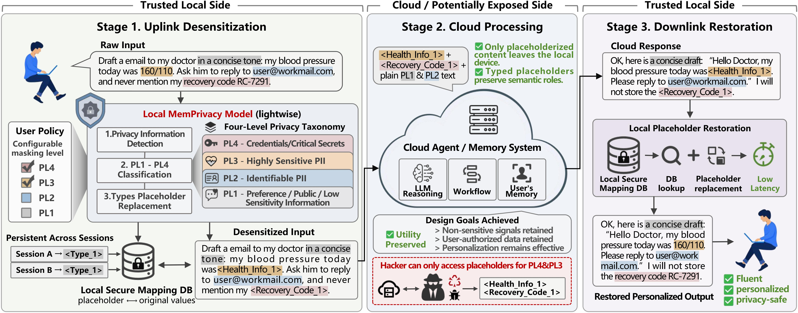
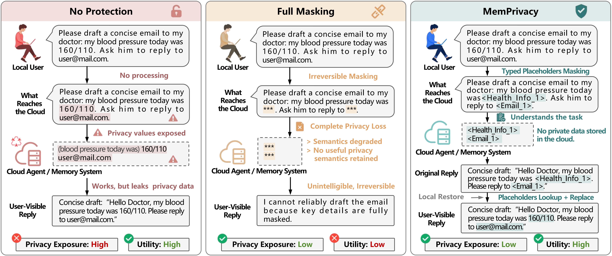
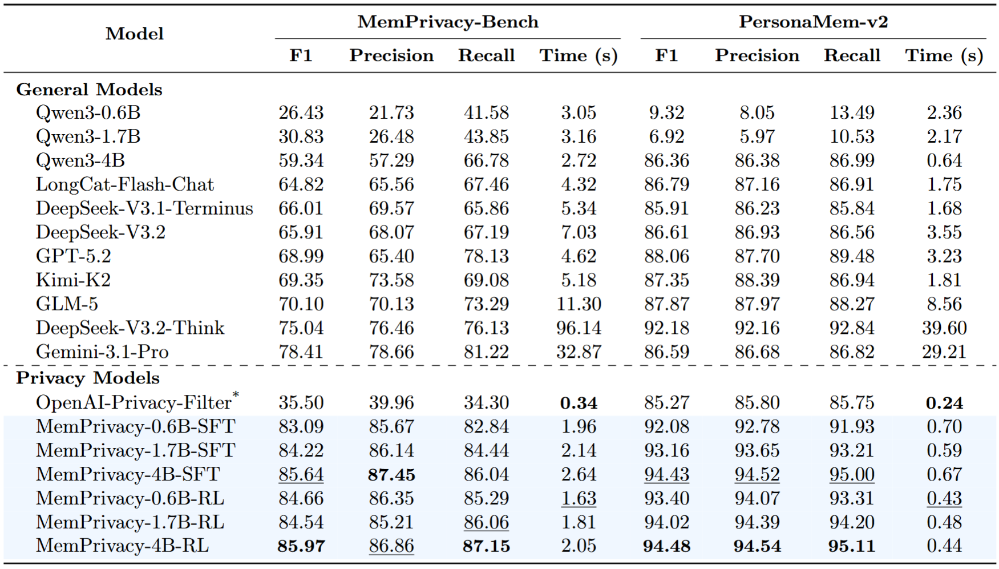
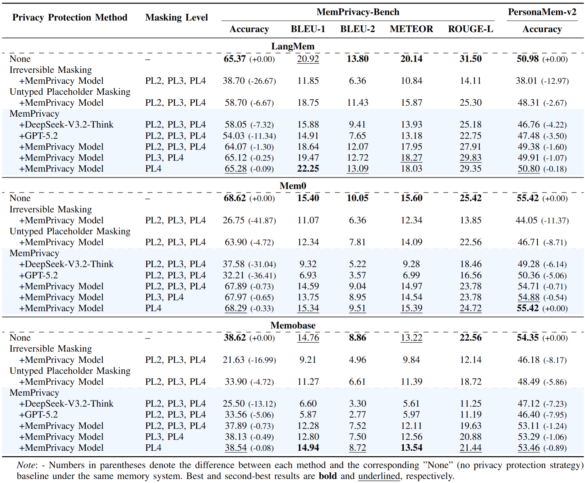

<h1 align="center">
    PrivMemAgent: Policy-Constrained Minimal Public Memory for Edge-Cloud Agents
</h1>

<p align="center">
<a href="https://spdx.org/licenses/CC-BY-NC-ND-4.0.html">
    
</a>
<a href="https://github.com/MemTensor/MemPrivacy/issues">
    
</a>
<a href="https://arxiv.org/abs/2605.09530">
     
</a>
<a href="https://huggingface.co/collections/IAAR-Shanghai/memprivacy">
    
</a>
<a href="https://modelscope.cn/collections/MemTensor/MemPrivacy">
    
</a>
</p>


PrivMemAgent is a research extension of the **MemPrivacy privacy-preserving
personalized memory framework** for **edge-cloud agents**. This branch adds
policy-constrained minimal public memory while retaining MemPrivacy's reversible
pseudonymization path. The cloud-isolation guarantee applies only when privacy
detection runs on a trusted local endpoint; remote detection requires explicit
opt-in and exposes raw input to that provider.


---

## Why MemPrivacy?

Cloud agents typically send user messages to remote LLMs and store conversation traces in memory systems (e.g., **Mem0**, **LangMem**, **Memobase**) for long-term personalization. This creates a large privacy attack surface:

- plaintext prompts and logs may contain **PII**, medical/financial data, credentials
- cloud memory stores can leak via retrieval, prompt injection, inversion, or misconfiguration
- naïve mitigation (e.g., `***` masking) **destroys task semantics**, harming retrieval and personalization

**Goal:** reduce privacy leakage **without sacrificing utility**.

---

## Core Idea

<div align="center">
    <table border="0">
        <tr>
            <td width="45%" align="center">
                
                <br>
                <em><strong>Fig 1.</strong> Overview of MemPrivacy. </em>
            </td>
        </tr>
    </table>
</div>

MemPrivacy implements **local reversible pseudonymization**:

1. **On-device privacy detection (local)**
   Detect privacy spans in user input and classify them by:
   - **privacy level** (PL1–PL4)
   - **privacy type** (e.g., Email, Real Name, Medical Health, Recovery Code)

2. **Typed placeholder replacement (local → cloud)**
   Replace protected spans with **semantically meaningful typed placeholders**, e.g.:
   - `160/110` (blood pressure) → `<Health_Info_1>`
   - `recovery code RC-7291` → `<Recovery_Code_1>`

3. **Local encrypted mapping (persistent across sessions)**
   Store an HMAC index and Fernet-encrypted original value in a namespace-isolated local SQLite DB.

4. **Cloud reasoning and memory operations (cloud)**
   The cloud agent/memory only sees placeholders—preserving semantic roles while hiding raw values.

5. **Downlink restoration (local)**
   Restore placeholders in the cloud response back to the original values for a fluent user experience.

With a local detector, this yields **architecture-level isolation**: cloud components never see/store raw sensitive values.

---

## Key Contributions & Advantages

<div align="center">
    <table border="0">
        <tr>
            <td width="45%" align="center">
                
                <br>
                <em><strong>Fig 2.</strong> Comparison of privacy protection strategies for local-to-cloud agent interactio. </em>
            </td>
        </tr>
    </table>
</div>

### 1) Privacy–Utility Balance (vs. masking)
- **Irreversible masking** (`***`) protects privacy but loses meaning and breaks memory retrieval.
- **Untyped placeholders** (`<Mask_1>`) keep structure but lose semantic roles.
- **MemPrivacy (typed placeholders)** preserve the semantic role *and* hide raw values, minimizing utility loss.

### 2) Configurable Protection via a 4-Level Privacy Taxonomy
MemPrivacy introduces **PL1–PL4** to support user-configurable policies:

| Level | Meaning | Examples | Typical Default Policy |
|---|---|---|---|
| PL1 | low sensitivity / preferences | “I like sci-fi”, tone, generic habits | can be kept for personalization |
| PL2 | identifiable PII | real name, phone, email, detailed address, account IDs | disallowed by default in long-term memory |
| PL3 | highly sensitive PII | health records, financial records, precise location, religion/ethnicity | not permitted in general memory |
| PL4 | critical secrets (immediately exploitable) | passwords, OTPs, recovery codes, API keys | **zero retention**; must be blocked/redacted |

### 3) Benchmark & Evaluation for Memory Systems
This repo builds **MemPrivacy-Bench** and evaluates privacy protection strategies across real memory systems:
- **MemPrivacy-Bench**: 200 synthetic users, bilingual (Chinese/English), multi-turn dialogues with dense privacy exposure, plus memory QA tasks.
- Evaluations on **MemPrivacy-Bench** (in-distribution) and **PersonaMem-v2** (out-of-distribution, annotated here).

### 4) Lightweight & Practical
The framework is designed for **edge deployment**:
- local detection + placeholder substitution + SQLite lookup are low-latency operations
- works as a drop-in privacy layer for existing cloud agents / memory systems

### 5) Open-Source MemPrivacy Models
We release a family of MemPrivacy models trained via Supervised Fine-Tuning (SFT) and Reinforcement Learning (RL) across different parameter sizes. You can access the full model collections on [Hugging Face](https://huggingface.co/collections/IAAR-Shanghai/memprivacy) and [ModelScope](https://modelscope.cn/collections/MemTensor/MemPrivacy).

| Model Name | Parameters | Method | HuggingFace Link | ModelScope Link |
| :--- | :---: | :---: | :--- | :--- |
| **MemPrivacy-4B-RL** | 4B | RL | [🤗 MemPrivacy-4B-RL](https://huggingface.co/IAAR-Shanghai/MemPrivacy-4B-RL) | [🤖 MemPrivacy-4B-RL](https://modelscope.cn/models/MemTensor/MemPrivacy-4B-RL) |
| **MemPrivacy-4B-SFT** | 4B | SFT | [🤗 MemPrivacy-4B-SFT](https://huggingface.co/IAAR-Shanghai/MemPrivacy-4B-SFT) | [🤖 MemPrivacy-4B-SFT](https://modelscope.cn/models/MemTensor/MemPrivacy-4B-SFT) |
| **MemPrivacy-1.7B-RL** | 1.7B | RL | [🤗 MemPrivacy-1.7B-RL](https://huggingface.co/IAAR-Shanghai/MemPrivacy-1.7B-RL) | [🤖 MemPrivacy-1.7B-RL](https://modelscope.cn/models/MemTensor/MemPrivacy-1.7B-RL) |
| **MemPrivacy-1.7B-SFT** | 1.7B | SFT | [🤗 MemPrivacy-1.7B-SFT](https://huggingface.co/IAAR-Shanghai/MemPrivacy-1.7B-SFT) | [🤖 MemPrivacy-1.7B-SFT](https://modelscope.cn/models/MemTensor/MemPrivacy-1.7B-SFT) |

---

## Evaluation Results

> **Reproducibility note:** the tables below are the values reported by the paper. This checkout now uses strict span-gated scoring and maximum-weight matching. Re-run the extractor and memory experiments before treating the displayed values as results produced by the current code.

### 1. Privacy Extraction Performance

<div align="center">
    <em><strong>Table 1.</strong> Performance comparison of different LLMs and MemPrivacy models on MemPrivacy-Bench and PersonaMem-v2.</em>
    
    <br>
</div>


**Key Takeaways:**

* **Superior Accuracy:** MemPrivacy consistently outperforms 11 general LLMs and **OpenAI-Privacy-Filter**. The best model (MemPrivacy-4B-RL) achieves F1 scores of **85.97%** and **94.48%**, significantly surpassing the top general models (78.41% and 92.18%). Even our smallest 0.6B model beats most general models.
* **Robustness on Complex Data:** While lightweight filters like OpenAI-Privacy-Filter are fast, they struggle with implicit and linguistically diverse privacy expressions (only 35.50% F1 on MemPrivacy-Bench). MemPrivacy accurately handles fine-grained, heterogeneous conversational scenarios.
* **High Efficiency:** Despite its accuracy, MemPrivacy remains highly efficient. Processing latency per message is consistently **below one second** on PersonaMem-v2, making it well-suited for seamless on-device deployment without noticeable delays.

### 2. Memory System Performance under Different Protection Methods

<div align="center">
    <em><strong>Table 2.</strong> Performance comparison under different privacy protection methods on three memory systems.</em>
    
    <br>
</div>


**Key Takeaways:**

* **Optimal Privacy-Utility Trade-off:** Compared to traditional masking (`***`) or untyped placeholders (`<Mask_1>`), MemPrivacy preserves the utility of downstream systems (LangMem, Mem0, Memobase) significantly better by retaining critical semantic roles.
* **Minimal Degradation:** When applying stringent protection (PL2–PL4), system accuracy drops by merely **0.71%–1.60%**. If protecting only critical secrets (PL4), the drop is **below 0.89%**.
* **Extractor Dependency:** The effectiveness of the entire framework heavily depends on accurate privacy extraction. Replacing the MemPrivacy model with general LLMs (e.g., DeepSeek-V3.2-Think, GPT-5.2) causes substantial accuracy degradation, validating the necessity of our specialized fine-tuning.

---


## What’s in This Repository?

High-level structure:

```text
MemPrivacy/
├── data/        # partial user data from the MemPrivacy-Bench and PersonaMem-v2 test sets
├── evaluation/  # evaluation on memory systems + metrics
└── src/         # privacy masking/pseudonymization core
```

### Core Components

- **Reversible pseudonymization module** (`src/privacy_masking.py`)
  - `PrivacyStore` (SQLite mapping store)
  - `mask_dialogue()`, `unmask_dialogue()`, `detect_and_mask_dialogue()`
  - masking modes: `type_specific`, `generic`, `complete`
- **Evaluation suite** (`evaluation/`)
  - memory systems: `eval_mem0.py`, `eval_langmem.py`, `eval_memobase.py`
  - metrics: `metric.py` (privacy extraction P/R/F1, level/type matching, etc.)
  - results saved to `evaluation/results/`

---

## How It Works (End-to-End)

### Stage A — Uplink Desensitization (Local)
- detect privacy spans locally (original text, privacy level, privacy type)
- apply a user policy: e.g., mask only **PL3+**, or **PL2–PL4**
- replace spans with typed placeholders
- store mapping locally (persistent across sessions)

### Stage B — Cloud Processing
- send only placeholderized text to the cloud LLM / memory system
- the cloud performs normal agent workflows (reasoning, tool use, memory write/retrieval) **and generates a response**
- cloud memory stores placeholders, not raw secrets

### Stage C — Downlink Restoration (Local)
- restore placeholders in the response using the local mapping DB
- user sees original values; cloud never receives them

---

## Quickstart

### 1) Installation

```bash
git clone https://github.com/nicebro123/PrivMemAgent.git
cd PrivMemAgent
python -m venv .venv
source .venv/bin/activate
pip install -r requirements.txt
```

For local checkpoint evaluation through vLLM on a supported Linux/CUDA host:

```bash
pip install -r requirements-vllm.txt
```

### 2) Configuration

To both use the core MemPrivacy framework and run the evaluation benchmarks, you need to configure two YAML files:

**1. `src/privacy_config.yaml` (For using the framework)**
This file controls the core reversible pseudonymization module. Key configurations include:
- **`llm`**: local OpenAI-compatible detector endpoint and model parameters. Non-local endpoints are rejected unless `allow_remote: true` is explicitly set.
- **`privacy`**: The local SQLite database path (`db_path`) for storing mapping rules, and the `mask_levels` (e.g., `PL3`, `PL4`) to define your privacy protection policy.

Set `MEMPRIVACY_STORE_KEY` to a Fernet key in production. If it is omitted, the library creates a mode-`0600` key under `~/.config/memprivacy/keys/`. The database and key must not be copied to the cloud together.

**2. `evaluation/eval_config.yaml` (For evaluating memory systems)**
This file configures the benchmarking suite across different memory systems (Mem0, Memobase, etc.). Key configurations include:
- **Global API Keys**: `openai_base_url` and `openai_api_key`.
- **Role-specific LLMs**: Distinct model settings for memory operations (`memory_llm`), generating answers (`answer_llm`), and automated evaluation (`judgment_llm`, `privacy_llm`).
- **System Configs**: Database paths and connection URLs for specific memory systems (e.g., `mem0_config`, `memobase`).

---

## Evaluate The Privacy Extractor

```bash
python -m evaluation.eval \
  --input data/memprivacy_bench_testset.jsonl \
  --output evaluation/results/memprivacy_with_predictions.jsonl \
  --metrics-output evaluation/results/extractor_metrics.json \
  --backend vllm \
  --model /absolute/path/to/checkpoint
```

When `--model` is a Hugging Face repository ID, `--revision` must be its
immutable 40-character commit SHA. Type scoring is exact by default; configure
the optional embedding endpoint arguments only when semantic type matching is
part of the declared evaluation protocol.

## Evaluate Memory Systems (Mem0 / LangMem / Memobase)

Example commands:

```bash
python -m evaluation.eval_mem0 \
  --input data/personamem_v2_testset.jsonl --mcq \
  --annotation-source oracle

python -m evaluation.eval_langmem \
  --input data/memprivacy_bench_testset.jsonl --no-mcq \
  --annotation-source oracle

python -m evaluation.eval_memobase \
  --input data/personamem_v2_testset.jsonl --mcq \
  --annotation-source oracle
```

Each command accepts `--mask/--no-mask`, `--mask-level`, `--mask-mode`,
`--user-num`, and `--num-workers`. Result and database directories are created
automatically. Mem0 storage is reset before each complete add-memory + QA run,
so stale memories cannot contaminate a repeated experiment.

`--annotation-source model` is the default scientific setting and requires
`privacy_info_llm` generated by `evaluation.eval`. The examples above explicitly
select `oracle` because the released partial JSONL files contain only reference
annotations. Model and oracle runs use separate storage and output names.

Validate annotations before running:

```bash
python tools/validate_dataset.py data/*.jsonl --report evaluation/results/data_audit.json
```

Validate the complete runtime before a costly memory experiment:

```bash
export OPENAI_BASE_URL="https://your-gateway.example/v1"
export OPENAI_API_KEY="..."
python -m tools.preflight_memory_eval --system mem0 --system langmem
```

Add `--system memobase` only when a Memobase server is reachable. Configuration
files may reference secrets as `$OPENAI_BASE_URL`, `$OPENAI_API_KEY`,
`$MEMOBASE_PROJECT_URL`, and `$MEMOBASE_API_KEY`; unresolved references fail
preflight instead of being treated as literal credentials.

The currently released partial files contain 10 annotations whose
`original_text` is absent from the corresponding message. Production APIs fail
closed on these records; evaluation wrappers log and skip them.

## Compile Minimal Public Memory

The deterministic minimal-sufficient baseline separates cloud-safe public
memory from encrypted local-only facts:

```bash
python -m evaluation.eval_public_memory \
  --input data/memprivacy_bench_testset.jsonl \
  --output evaluation/results/minimal_public.jsonl \
  --metrics-output evaluation/results/minimal_public_metrics.json \
  --state-dir evaluation/results/minimal_public_state \
  --cloud-safe-dataset-output evaluation/results/minimal_public_benchmark.jsonl \
  --annotation-source oracle
```

The JSONL output contains public representations and raw-free provenance only.
Exact local values remain in the encrypted state directory; PL4 values are not
retained. Use `src/public_memory_config.yaml` to configure policy, alias scopes,
selection budgets, context minimization, and leakage gates.

The optional cloud-safe dataset preserves the benchmark schema while protecting
dialogues, questions, options, answers, evidence, and user identifiers. It can
be passed to the existing memory runners without a second masking layer:

```bash
python -m evaluation.eval_mem0 \
  --input evaluation/results/minimal_public_benchmark.jsonl \
  --no-mask --mcq
```

Keep the generated state directory on the trusted edge. Do not upload it with
the cloud-safe JSONL.

Evaluation logic:
1. feed dialogues turn-by-turn into the memory system (optionally with MemPrivacy masking)
2. protect known sensitive values in questions and options before cloud retrieval
3. keep retrieved memories and generated responses protected through cloud judging
4. restore only the final local result artifact
5. compute privacy leakage / extraction metrics

---

## Use MemPrivacy in Your Own Agent (Minimal Example)

The reversible pseudonymization APIs live in:

- `src/privacy_masking.py` (core)
- `evaluation/privacy_masking.py` contains tolerant wrappers for auditing imperfect benchmark annotations

Conceptual usage:

```python
from src.privacy_masking import PrivacyStore, mask_dialogue, unmask_dialogue

store = PrivacyStore(
    db_path="local_privacy_store.sqlite",
    namespace=user_id,
)

masked_text = mask_dialogue(
    dialogue_text=user_text,
    privacy_items=detected_privacy_items,  # produced locally by MemPrivacy model
    store=store,
    mask_levels=["PL2", "PL3", "PL4"],
)

# send masked_text to cloud...

restored = unmask_dialogue(cloud_response_text, store=store)
```

### Masking Modes
- `type_specific`: configure `PrivacyStore(mask_mode="type_specific")`
- `generic`: configure `PrivacyStore(mask_mode="generic")`
- `complete`: remove sensitive spans entirely (max privacy, lowest utility)

Generated reversible placeholders include a random collision-resistant suffix,
for example `<MPM_Email_1_a1b2c3d4e5f6>`.

### Policy Control (Privacy Levels)
You can enforce a masking threshold such as:
- protect `PL4` only (credentials)
- protect `PL3+` (highly sensitive + secrets)
- protect `PL2–PL4` (most conservative)

### Tests

```bash
pip install -r requirements-dev.txt
pytest
ruff check src evaluation tests tools
```

Development notes:

- [Correctness and reproducibility](docs/CORRECTNESS_NOTES.md)
- [Minimal sufficient public memory roadmap](docs/INNOVATION_ROADMAP.md)
- [Minimal public memory preliminary results](docs/PRELIMINARY_RESULTS.md)
- [Memory evaluation runbook](docs/MEMORY_EVAL_RUNBOOK.md)

---

## Citation

If you use MemPrivacy-Bench, the taxonomy, or the framework, please cite:

```bibtex
@misc{chen2026memprivacyprivacypreservingpersonalizedmemory,
      title={MemPrivacy: Privacy-Preserving Personalized Memory Management for Edge-Cloud Agents},
      author={Yining Chen and Jihao Zhao and Bo Tang and Haofen Wang and Yue Zhang and Fei Huang and Feiyu Xiong and Zhiyu Li},
      year={2026},
      eprint={2605.09530},
      archivePrefix={arXiv},
      primaryClass={cs.CR},
      url={https://arxiv.org/abs/2605.09530},
}
```

---

## Disclaimer

This project is intended for **privacy research and evaluation**.
Do **not** use it to process real user secrets without proper security controls, threat modeling, and compliance review. Always follow local laws and organizational policies.
